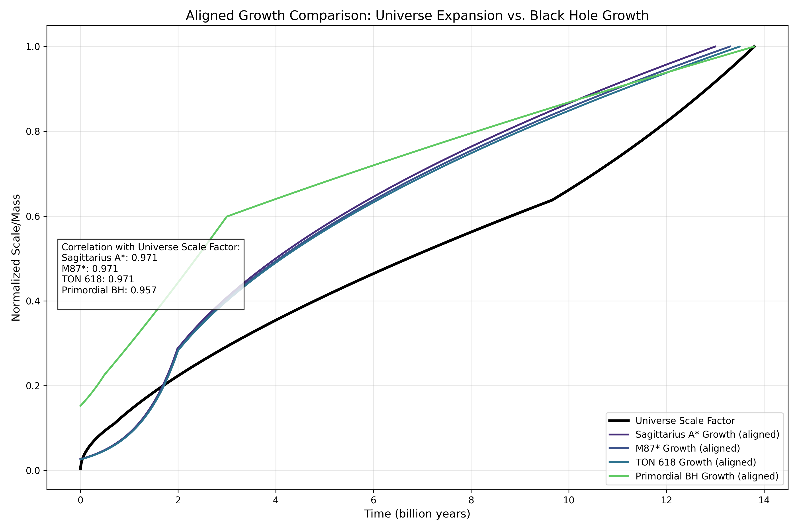

# Black Hole Cosmology: Universe as a Higher-Dimensional Artifact



## ⚠️ IMPORTANT DISCLAIMER

**This repository represents a speculative thought experiment, not formal scientific research.**

I am not an astrophysicist, cosmologist, or physicist of any kind. The contents of this repository should be viewed as a creative exploration of interesting mathematical correlations rather than a rigorous scientific study. Any apparent significant findings are likely coincidental or the result of the limited mathematical forms growth curves can take.

The hypothesis explored here - that growth rate spikes in cosmic expansion might correlate with black hole feeding events in a higher dimension - is highly speculative and not supported by mainstream cosmology. While legitimate scientific references are cited, they are used as inspiration rather than direct evidence for the claims made.

## Project Overview

This project was inspired by a curious observation: when normalized and aligned properly, the expansion curve of our universe appears remarkably similar to the growth curves of black holes. Through data visualization and correlation analysis, I explore this similarity and speculate on its potential implications.

The core findings include:
- A correlation coefficient of approximately 0.97 between universe expansion and various black hole growth patterns
- Similar growth rate spike patterns between cosmic expansion and black hole accretion events
- Potential interpretations through the lens of black hole cosmology theories

## Repository Contents

- **Findings.md**: Main document detailing the correlation analysis and speculative hypotheses
- **References.md**: Academic references related to cosmology, black hole physics, and black hole universe theories
- **aligned_growth_comparison.png**, **detailed_growth_comparisons.png**: Visualizations of growth patterns and correlations
- **aligned_growth_comparison.py**: Python script that generates the visualizations and correlation analysis

## To Run

The project uses Python 3.11 or later. To set up and run the analysis:

```bash
pip install -r requirements.txt
python aligned_growth_comparison.py
```

## Key Visualization

The primary visualization shows how the universe's scale factor growth (black line) correlates with normalized growth patterns of various black holes when properly aligned. The growth rate comparison in particular shows intriguing similarities in pattern despite the vastly different scales and physical processes involved.

## For Actual Cosmologists

If you have formal training in cosmology or astrophysics and happen to stumble across this repository, I welcome your critical feedback. Please keep in mind this is an amateur exploration inspired by curiosity rather than a serious attempt to challenge established cosmological models.

## License

This project is shared under the MIT License, meaning you're free to use, modify, and distribute it as you wish. 